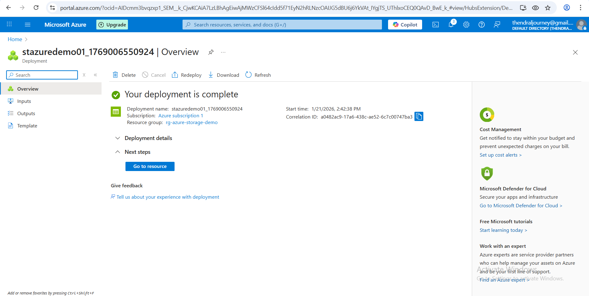

### ☁️ Project 3: Azure Storage Account 

## 📌 Project Description

This project demonstrates how to create and manage an Azure Storage Account using the Azure Portal. A resource group was created, a storage account was added, a Blob container was created, and a sample file was uploaded. Finally, the resource group was deleted to ensure zero cost.  

## 🔧 Tools Used

- Microsoft Azure Portal  
- Azure Free Tier Account  
- GitHub (for documentation)

### 🧩 Step-by-Step Implementation

### ✅ Step 1: Create Resource Group 

Resource Group Name: rg-azure-storage-demo

Region: UK South 

### ✅ Step 2: Create Storage Account

Go to Storage Accounts → Create

Subscription :	Azure subscription 1

Resource Group:	rg-azure-storage-demo

Storage Account Name:	stazuredemo01

Region:	UK South

Performance:	Standard

Redundancy:	LRS (Locally Redundant Storage)

Click Review + Create → Create

✔ Storage account created

### ✅ Step 3: Explore Storage Account

Go inside Storage Account

Check available services:

Blob Storage (files & documents)
File Share
Tables
Queues

✅ Step 4: Upload Sample File 

Go to Blob → Containers → + Container

Name: test-container

Access level: Private

Upload a text file

File uploaded in container

### ✅ Step 5: Delete Storage Account (Zero Cost)

Go to Resource Group → rg-azure-storage-demo

Click Delete Resource Group

Type resource group name → Confirm

✔ All resources deleted ✅

## 📸 Screenshots

### 🔹 Storage Account Overview

### 🔹 Blob Container Created

### 🔹 Sample File Uploaded

### 🔹 Resource Group Deleted

## Skills Learned
- Azure Storage Account creation  
- Blob storage and file upload  
- Resource Group management  

- Basic cloud storage operations  

---

